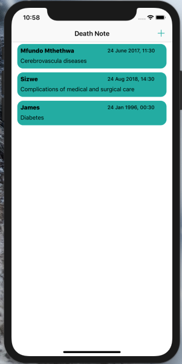
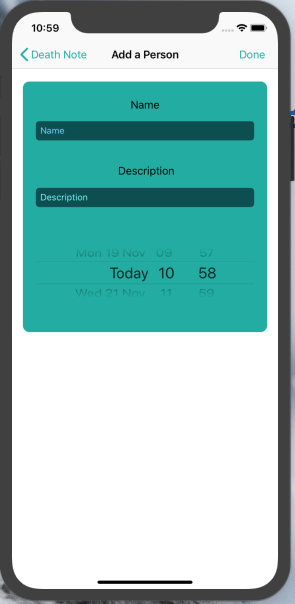

# Death-Note
Death Note Is a manga in which Light Yagami is the owner of a notebook of death. The person whose name is written in this book dies inevitably.

Death Note allow you to understand how the table views, that are used extensively in iOS applications, works. It is a way of presenting similar data.

It will also teach you how to change the view on an application and how to go back to an old view.

# Screanshots

 
 